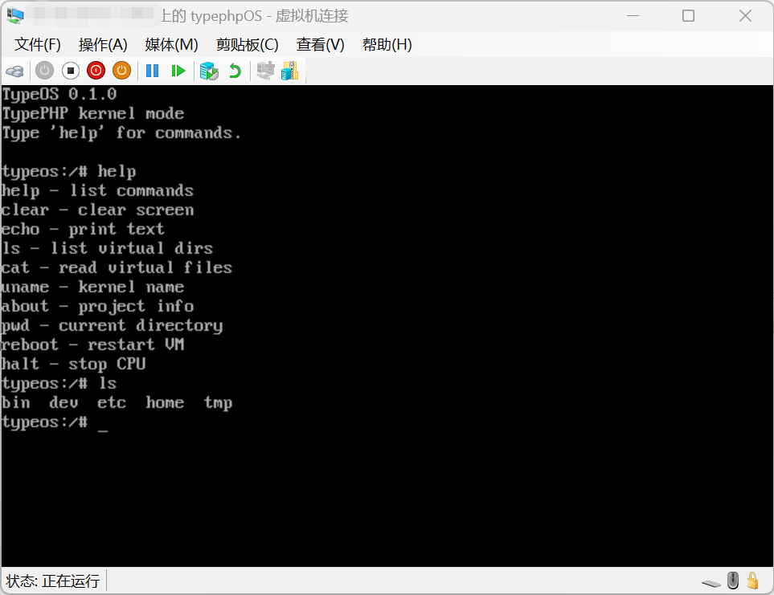

# TypeOS

[简体中文](README.md) | English

TypeOS is a small educational Linux/Unix-like operating system prototype. Its main policy layer is written in TypePHP.

### Overview

TypeOS is a small educational Linux/Unix-like operating system prototype. It boots through a traditional BIOS, switches to 32-bit i386 protected mode, writes to VGA text memory, reads a PS/2 keyboard, and runs a tiny shell generated from TypePHP.

The current version is <code>0.1.0</code>. The immediate goal is to prove that the main OS policy and shell logic can be written in TypePHP and compiled into a real bootable image. TypeOS is not the Linux kernel and does not provide a complete POSIX compatibility layer.

### Runtime Screenshot

TypePHP OS booted and running in a VMware virtual machine:

### Features

- BIOS boot sector and kernel loading;
- 32-bit i386 protected mode;
- VGA text output with a visible hardware cursor;
- Polling-based PS/2 keyboard input;
- TypePHP-based input loop, parser, and command dispatcher;
- In-memory demo directories and files: <code>/</code>, <code>/bin</code>, <code>/etc</code>, <code>/etc/motd</code>, and <code>/etc/os-release</code>;
- <code>help</code>, <code>clear</code>, <code>echo</code>, <code>ls</code>, <code>cat</code>, <code>uname</code>, <code>about</code>, <code>pwd</code>, <code>reboot</code>, and <code>halt</code>;
- BIOS-bootable floppy and El Torito ISO images.

### Where TypePHP is used

The main policy layer is [typephp/kernel.php](typephp/kernel.php). It implements the prompt, keyboard input loop, command and path recognition, command dispatch, and the in-memory demo filesystem.

The remaining C++/assembly code is limited to hardware and boot responsibilities:

- [kernel/hal.cpp](kernel/hal.cpp): VGA, PS/2 keyboard, reboot, and halt;
- [kernel/entry.S](kernel/entry.S): protected-mode entry, BSS clearing, and the TypePHP entry call;
- [boot/boot.S](boot/boot.S): BIOS disk reads, A20 setup, and the protected-mode transition.

### Build pipeline

~~~text
typephp/kernel.php
        │
        │ Official TypePHP tpc
        ▼
Pure scalar C++ generated from TypePHP
        │
        │ Freestanding adapter + Clang
        ▼
TypePHP policy + C++ HAL + assembly entry
        │
        ├── build/typeos.img
        └── build/typeos.iso
~~~

The normal TypePHP <code>bin</code> mode depends on PHPX/PHP Embed, while a BIOS bare-metal kernel has no operating system, libc, or PHP runtime. The build script therefore generates C++, keeps the pure scalar function section, removes PHPX/Zend extension-registration code, adds a minimal integer/bool adapter, and links the result as a freestanding kernel.

This is not a C++ shell pretending to be TypePHP: the TypePHP source is part of the final kernel. C++ is currently used only at the hardware boundary and for the small freestanding compatibility layer. The current adapter intentionally supports only integers, booleans, and fixed hardware calls.

### Repository layout

~~~text
boot/                       BIOS boot sector and linker script
kernel/                     Protected-mode entry, HAL, and runtime adapter
typephp/kernel.php          Main TypePHP policy and shell code
typephp/hal.stub.php        TypePHP declarations for hardware calls
typephp/project.yml         tpc project configuration
assets/typephp-os-v0.1.0-vmware.png  VMware runtime screenshot
build.ps1                   TypePHP generation and image build script
run.ps1                     QEMU launcher
~~~

<code>build/</code> and <code>toolchain/</code> are local-only directories and are ignored by Git. Bootable images are published as GitHub Release assets instead of being added to the source history.

### Requirements

- Windows 10/11;
- PowerShell 7 recommended;
- TypePHP <code>tpc</code> v0.8.0 for Windows x64;
- Clang, LLD, and <code>llvm-objcopy</code> with i386 target support;
- QEMU, VirtualBox, or VMware for runtime testing.

The local TypePHP toolkit is intentionally not committed because it contains large binary files. If you clone this repository, download the matching official toolkit from the [TypePHP documentation](https://swoole.com/aot/zh), then set:

~~~powershell
$env:TYPEOS_TPC = 'D:\tools\typephp\tpc.exe'
$env:TYPEOS_TYPEPHP_HOME = 'D:\tools\typephp'
~~~

Make sure <code>clang.exe</code>, <code>clang++.exe</code>, <code>ld.lld.exe</code>, and <code>llvm-objcopy.exe</code> are available on PATH, or set <code>TYPEOS_CLANG</code>, <code>TYPEOS_CLANGXX</code>, <code>TYPEOS_LLD</code>, and <code>TYPEOS_OBJCOPY</code>.

### Build

From the repository root:

~~~powershell
.\build.ps1
~~~

The script produces:

~~~text
build/typeos.img             1.44 MB BIOS floppy image
build/typeos.iso             El Torito BIOS bootable ISO
build/boot.bin               512-byte boot sector
build/kernel.elf             Kernel ELF file
build/kernel.bin             Kernel binary written to boot media
build/typephp-generated/      tpc-generated C++ and freestanding source
~~~

If a virtual machine has <code>typeos.iso</code> mounted and Windows locks it, use a different output name:

~~~powershell
.\build.ps1 -IsoName typeos-fixed.iso
~~~

### Run with QEMU

Boot the ISO:

~~~powershell
qemu-system-i386 -m 32M -cdrom build\typeos.iso -boot order=d
~~~

Or use the launcher:

~~~powershell
.\run.ps1 -Iso
~~~

For a custom ISO name:

~~~powershell
.\run.ps1 -Iso -IsoName typeos-fixed.iso
~~~

You can also boot the floppy image:

~~~powershell
qemu-system-i386 -m 32M -fda build\typeos.img -boot order=a
~~~

### Run with VirtualBox or VMware

Create an “Other/Unknown 32-bit” VM, disable UEFI and Secure Boot, attach <code>build/typeos.iso</code> to the virtual optical drive, and put the optical drive first in the boot order. Click the VM console after boot so that the guest captures keyboard input.

The ISO uses El Torito 1.44 MB floppy emulation. The BIOS maps the embedded floppy image as the traditional A: drive, so no additional hard disk or filesystem is required.

### Shell commands

~~~text
help
clear
echo hello
echo typephp
ls
ls /bin
ls /etc
cat /etc/motd
cat /etc/os-release
uname
about
pwd
reboot
halt
~~~

The directories and files are fixed TypePHP output for demonstration purposes. There is no real disk filesystem yet, and the contents reset after reboot.

### Limitations

- Traditional BIOS and 32-bit i386 protected mode only;
- No UEFI, Secure Boot, or 64-bit boot path;
- No IDT, PIC, interrupts, timers, processes, user mode, or permissions;
- Polling-based keyboard input with English ASCII support only;
- No disk driver or real filesystem;
- The bootloader currently reads at most 128 kernel sectors, or 64 KB;
- The TypePHP bare-metal adapter currently supports only integers, booleans, and fixed hardware calls;
- This is an educational prototype, not a production operating system.

### Verification

The following has been verified:

- Official <code>tpc</code> generates C++ from the TypePHP sources;
- The pure TypePHP function section compiles with freestanding Clang;
- The kernel links with LLD without undefined symbols;
- The boot sector is exactly 512 bytes and ends in <code>55 AA</code>;
- The floppy image and ISO contain identical boot media data;
- The ISO contains a valid El Torito boot catalog and basic ISO9660 structures.

Automated QEMU boot testing is not configured yet. Before publishing a Release, test the image in QEMU and at least one desktop virtualization product.

### Roadmap

1. Add an IDT, PIC, and timer;
2. Add a small memory allocator;
3. Move keyboard input to interrupts;
4. Add disk access and a read-only filesystem;
5. Design a TypePHP user-mode loader and syscall ABI;
6. Gradually expand the TypePHP runtime available to the kernel and user programs.

### License

This project is released under the MIT License; see [LICENSE](LICENSE). The copyright holder is currently listed as `TypePHP OS contributors`. Replace that line with your name or organization if needed.
